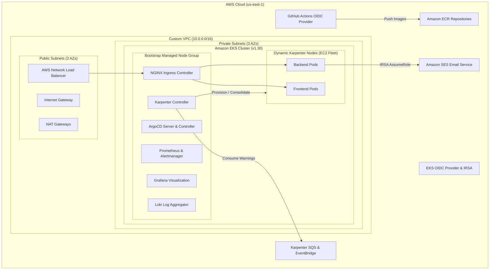

# Repository 1 — `eks-platform-infra`

> **Cloud-Native EKS Platform Infrastructure as Code**  
> Modular Terraform provisioning AWS network topology, Amazon EKS, IAM/IRSA, Amazon ECR, Amazon SES, Karpenter autoscaling, ArgoCD GitOps, NGINX Ingress Controller, and Prometheus/Loki/Grafana Observability stack.

---

## 🏗️ Architecture Overview



---

## 📁 Repository Structure

```
eks-platform-infra/
├── .github/
│   └── workflows/
│       └── terraform.yml          # GitHub Actions CI with manual Plan/Apply/Destroy triggers
├── terraform/
│   ├── modules/
│   │   ├── vpc/                   # VPC, Subnets, IGW, NAT GW, Route Tables, Tags
│   │   ├── eks/                   # EKS Cluster, KMS Encryption, System NodeGroup, Addons
│   │   ├── iam/                   # IRSA Roles, GitHub Actions OIDC, Karpenter Roles
│   │   ├── ecr/                   # ECR Repositories with scanning and lifecycle rules
│   │   ├── ses/                   # Amazon SES domain/email identity & policies
│   │   ├── karpenter/             # Karpenter Helm chart, SQS Interruption, EventBridge
│   │   ├── argocd/                # ArgoCD Helm installation & ServiceMonitors
│   │   ├── ingress-nginx/         # Ingress-NGINX Controller with AWS NLB annotations
│   │   └── observability/         # Prometheus, Loki, Promtail, Grafana
│   ├── environments/
│   │   └── dev/                   # Dev environment composition
│   │       ├── main.tf
│   │       ├── variables.tf
│   │       ├── outputs.tf
│   │       ├── providers.tf
│   │       ├── backend.tf
│   │       └── terraform.tfvars
│   ├── main.tf
│   ├── variables.tf
│   ├── outputs.tf
│   ├── providers.tf
│   ├── backend.tf
│   └── terraform.tfvars.example
├── scripts/
│   ├── deploy-infra.sh            # Local deployment wrapper
│   ├── destroy-infra.sh           # Safe infrastructure teardown wrapper
│   └── validate-terraform.sh      # Formatting and validation script
└── README.md
```

---

## ⚙️ Module Breakdown

| Module | Purpose | Key Resources Provisioned |
|---|---|---|
| **`modules/vpc`** | AWS Network foundation | 3 Public Subnets, 3 Private Subnets, IGW, NAT Gateway, Route Tables, ELB Subnet Discovery Tags |
| **`modules/eks`** | Kubernetes Control Plane & Bootstrap nodes | EKS Cluster v1.30, OIDC Provider, KMS Secret Encryption, VPC-CNI, CoreDNS, Kube-Proxy, EBS-CSI, System Managed Node Group |
| **`modules/iam`** | Least-privilege IAM & IRSA | GitHub Actions OIDC Role for ECR, Backend SES IRSA Role, Karpenter Controller IRSA Role, Karpenter Node Instance Profile |
| **`modules/ecr`** | Container registries | `frontend-app` and `backend-app` ECR repositories, Scan-on-push, AES256 encryption, 30-day lifecycle retention |
| **`modules/ses`** | Email delivery infrastructure | SES Configuration Set, Verified Email/Domain Identity, SES Sending IAM Policy |
| **`modules/karpenter`** | Just-in-time node autoscaler | Karpenter Helm release, SQS Interruption Queue, EventBridge rules (Spot Interruption, Rebalance, State-change) |
| **`modules/argocd`** | GitOps Continuous Delivery | ArgoCD Helm release in `argocd` namespace with ServiceMonitors and HA configuration |
| **`modules/ingress-nginx`** | Ingress Layer | NGINX Ingress Controller Helm release exposed through AWS Network Load Balancer (NLB) |
| **`modules/observability`** | Full-stack Observability | `kube-prometheus-stack` (Prometheus, Alertmanager, Grafana) + Grafana Loki + Promtail DaemonSet in `monitoring` namespace |

---

## 🔒 Security & IRSA Configuration

### 1. Pod Authentication via EKS OIDC / IRSA
Workloads never store static AWS keys in containers or Kubernetes secrets. Instead:
- Backend Pod uses ServiceAccount `backend-ses-sa` annotated with `eks.amazonaws.com/role-arn`.
- AWS SDK v3 automatically assumes the role via OpenID Connect Web Identity Token file injection.

### 2. GitHub Actions OIDC Authentication
CI pipelines authenticate to AWS via OpenID Connect federated token:
- Trust policy restricts access specifically to `repo:<org>/<repo>:*`.
- Zero long-lived `AWS_ACCESS_KEY_ID` or `AWS_SECRET_ACCESS_KEY` required in GitHub secrets.

---

## 🚀 Deployment & Pipeline Usage

### Method A: Automated GitHub Actions Pipeline
The pipeline `.github/workflows/terraform.yml` runs automatic linting and plans on PRs, and supports **Manual Triggers (`workflow_dispatch`)**:
1. Navigate to **Actions** -> **EKS Platform Infrastructure CI/CD** -> **Run workflow**.
2. Select:
   - **Action**: `plan`, `apply`, or `destroy`.
   - **Environment**: `dev`, `staging`, or `prod`.
   - **Auto-approve**: Check `true` to apply without manual approval prompt.

### Method B: Local CLI Deployment

```bash
# 1. Configure AWS CLI
aws configure

# 2. Validate Terraform code
./scripts/validate-terraform.sh

# 3. Deploy Dev Environment
cd terraform/environments/dev
terraform init
terraform plan -out=tfplan
terraform apply tfplan

# 4. Update local kubeconfig
aws eks update-kubeconfig --region us-east-1 --name eks-platform-dev

# 5. Verify cluster nodes and platform pods
kubectl get nodes -o wide
kubectl get pods -A
```

---

## 🧹 Teardown / Cleanup Procedure

```bash
# Automated via script:
./scripts/destroy-infra.sh dev

# Or directly with Terraform:
cd terraform/environments/dev
terraform destroy -auto-approve
```
